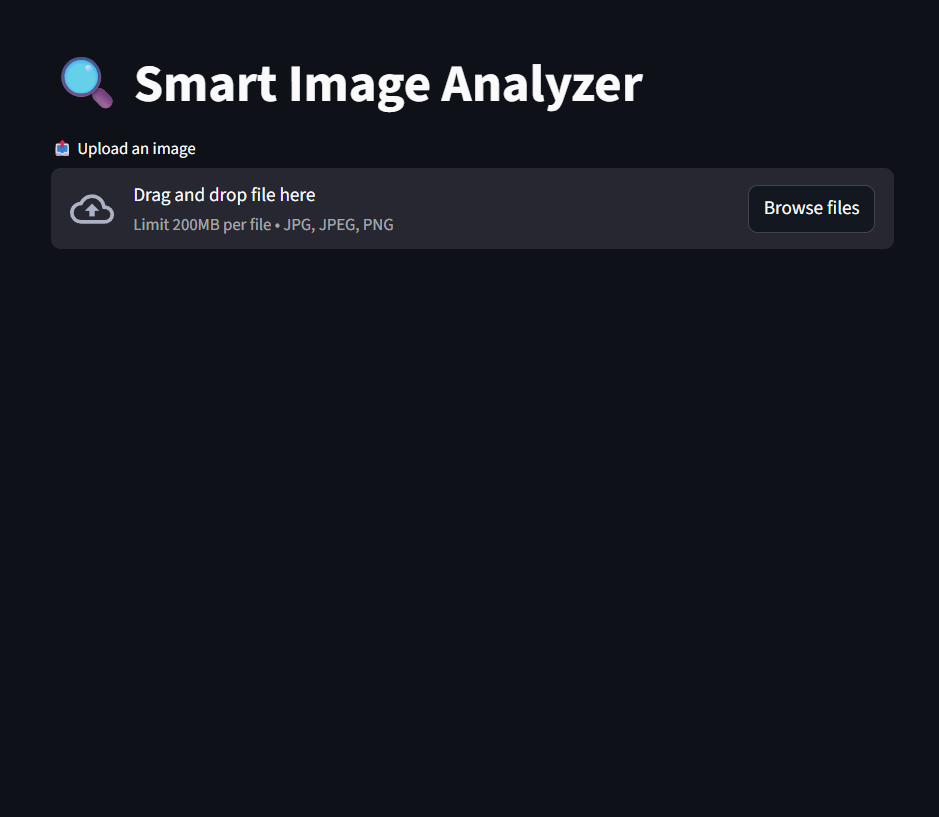
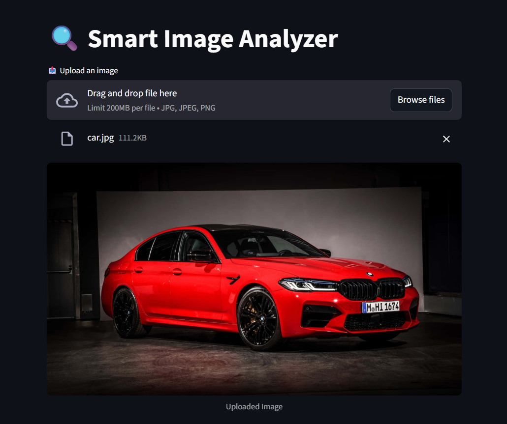
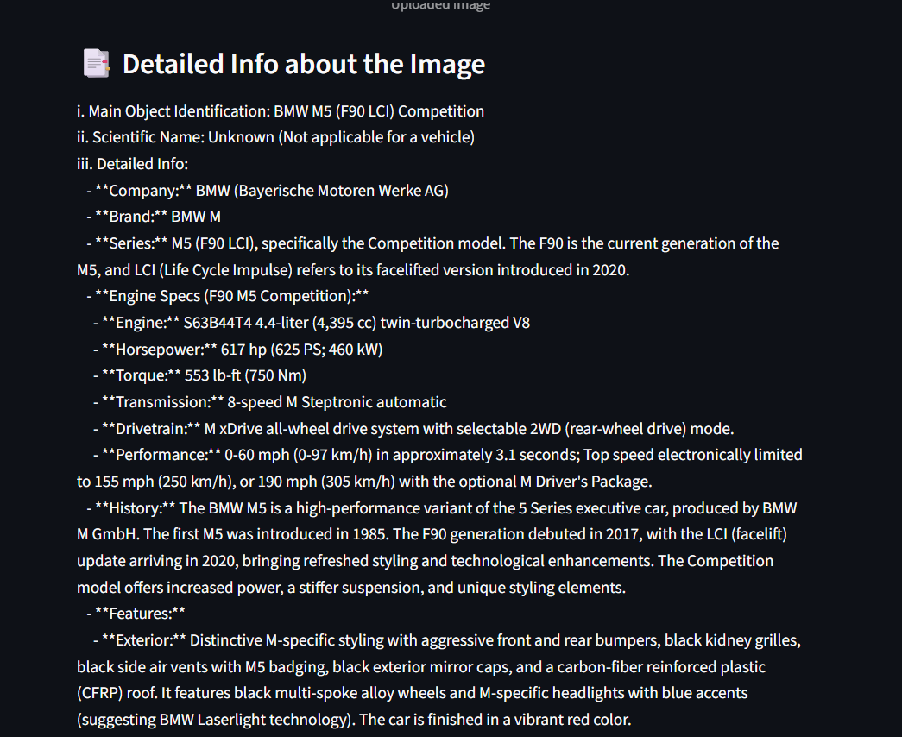
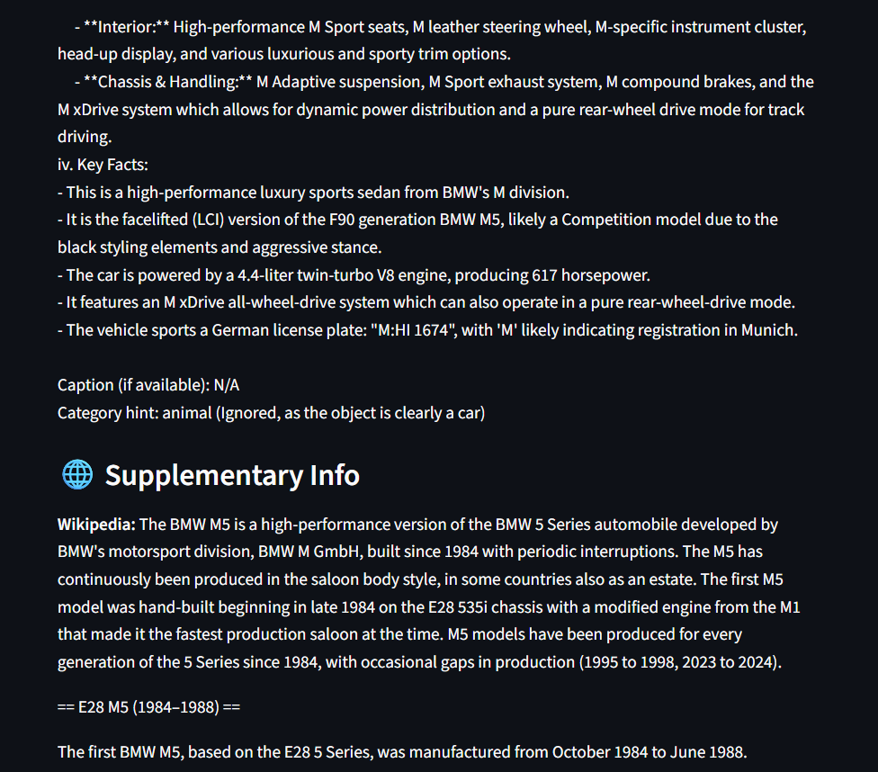

<h1 align="center">🔎 Smart Image Analyzer</h1>

An AI-powered image analysis system built using Python, Streamlit, CLIP, BLIP, and Google Gemini API.

## 📌 Overview

The Smart Image Analyzer is an intelligent web application that automatically analyzes and explains images using advanced AI models.

It demonstrates the integration of multiple artificial intelligence technologies to convert visual information into meaningful insights.

Core concepts demonstrated in this project:

• Computer vision using CLIP 
• Image caption generation using BLIP 
• Contextual reasoning using Google Gemini 
• Knowledge retrieval using external APIs 
• Interactive web deployment using Streamlit 

The application allows users to upload an image and receive detailed explanations, key facts, and contextual information about the detected object.

---

## 🧩 Features

• Image Upload Interface 
• Drag-and-drop or browse image upload using Streamlit 

• AI Object Identification 
• CLIP (Contrastive Language–Image Pretraining) identifies the main object or scene category in the image 

• Automatic Image Captioning 
• BLIP (Bootstrapping Language Image Pretraining) generates descriptive captions for the uploaded image 

• Contextual AI Reasoning 
• Google Gemini API provides deeper explanations and structured insights about the object 

• Supplementary Knowledge Integration 
• Wikipedia API retrieves verified factual information 
• DuckDuckGo Instant Answer API provides additional contextual data 

• Structured Output Display 
• Main object identification 
• Detailed information about the object 
• Key facts and insights 
• Supplementary information section 

---

## 🛠 Tech Stack

• Programming Language: Python 
• Frontend Framework: Streamlit 
• Deep Learning Framework: PyTorch 
• Vision Models: OpenAI CLIP, Salesforce BLIP 
• Generative AI: Google Gemini API 
• Data APIs: Wikipedia API, DuckDuckGo Instant Answer API 
• Tools: VS Code / Python Environment, Git, Streamlit 

Libraries Used:

• Transformers 
• TorchVision 
• Pillow 
• Requests 

---

## ⚙️ Setup Instructions

**1️⃣ Clone the Repository**

git clone https://github.com/yourusername/smart-image-analyzer.git

cd smart-image-analyzer

**2️⃣ Install Dependencies**

pip install -r requirements.txt

**3️⃣ Configure Gemini API Key**

Add your Gemini API key in the project environment variables.

Example:

export GEMINI_API_KEY="your_api_key"

**4️⃣ Run the Application**

streamlit run main.py

---

## 🖼️ Screenshots

### 📤 Image Upload Interface

  

---

### 📷 Uploaded Image Preview

  

---

### 🧠 Detailed AI Analysis

  

---

### 🌐 Supplementary Information

  

---

## 📌 Future Improvements

• Multi-object detection using YOLOv8 
• Voice interaction (speech-to-text and text-to-speech) 
• Multilingual image explanations 
• Edge-device inference support 
• Mobile application deployment 
